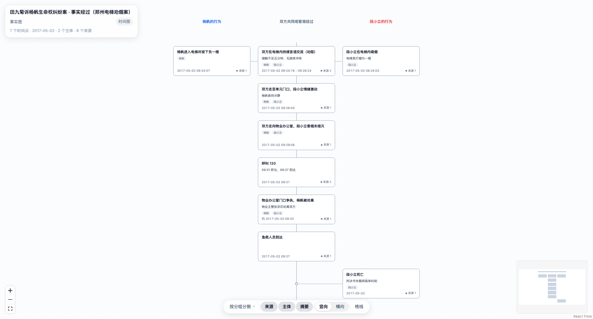

# 案图 antu

> 法律可视化渲染内核：**一份 JSON 进去，一个能双击打开的 HTML 出来。**



*真实案例：田九菊诉杨帆生命权纠纷案（郑州电梯劝烟案）的事实经过*

## 这是什么

案图解决一件事：把法律案件的事实，画成一张能看、能发、能归档的图。

- **规范**回答"画什么"：一份 JSON 描述时间槽、参与主体、分组、来源；
- **引擎**回答"怎么画"：读 JSON，渲染成图；
- **引擎不生成 JSON**。读文书、提取事实、写 JSON 是 agent 的事。

## 怎么用

### 自己出一份成品

```bash
npm install
npm run diagram -- examples/fact-电梯劝烟案.json
# → examples/fact-电梯劝烟案.html
```

产物是**一个自包含的 HTML**：引擎和数据都在里面，不联网、不要服务器、离线可看（约 420 KB）。
发微信、当邮件附件、归档都行，对方双击就能打开。

### 本地开发

```bash
npm run dev              # → http://localhost:5200，默认打开第一份示例
npm run dev 后换一份    # 加 ?example=3 按清单取，或 ?spec=examples/某份.json
```

开发时数据也走"内联"这条路：`vite.config.js` 里的插件把一份 JSON 注进页面，
和成品完全一致。示例清单住在那个插件里，**成品里一个字节都不带**。

## 现在能画什么

顶层分四个大类，**目前做完的是事实图下的第一个子类：时间图**。

| 大类 | 状态 |
|---|---|
| 事实图 `fact` | ✅ 时间图（第一个子类） |
| 关系图 `relationship` | 未开始 |
| 程序图 `procedure` | 未开始 |
| 证成图 `justification` | 搁置 |

时间图这一个子类已经能做到：

- **三种形态**：单主体、双主体、多主体。切换靠**视角**，数据一个字不改；
- **横竖两个方向**：时间向下或向右。默认按时间点个数自动选（≥5 用竖向，≤4 用横向）；
- **卡片字段可选**：来源、主体、摘要，开哪个卡片就长哪个，整张图跟着重排；
- **来源可溯源**：卡片上标明有没有出处，悬停看是哪几份材料，点开看摘录全文。

实测：8 份示例（含 2 个真实案例）、23 个视角、53 条事件、46 种视角 × 方向组合全部能排。

## 四个想清了的决定

**schema 只到大类。** 大类之下没有"子类型"字段。子类是**渲染层的划分**，是同一份 JSON 的几种画法。
由此带一条硬约束：**任意一份合法的大类 JSON，都必须能用该大类的任意一个子类渲染。**
所以将来加了泳道图，已有的每一份 fact JSON 立刻就能用它看，数据不用动。

**产物是一个文件，不是一个网站。** 法律工作是文件中心的：要归档、要传阅、要当附件、要能离线看。
服务端方案在这四条上都不顺手。

**数据与呈现分离。** 换视角、换方向、换卡片字段、换画法，数据都不动一个字。

**来源只标出处，不跳转。** 页面上写明"依据在哪一份材料、哪一页"，材料由用户自己去找。

## 目录

```
antu/
├── spec/                       ← 规范（先读这个）
│   ├── v0-architecture.md          架构共识：四大类、子类、产物形态
│   ├── fact-schema-draft.md        fact 的 JSON schema（v1 定稿）
│   ├── fact-timeline-rules.md      时间图的排布规则
│   ├── fact-rendering.md           画面元素、可调参数、为什么这么画
│   ├── source-schema-draft.md      来源的 7 类字段
│   ├── mcp-server.md               MCP 服务端：给 agent 的入口
│   └── react-flow-features.md      画布库的用法与踩坑记录
├── examples/                   ← 示例数据；raw/ 里是真实案例的原始文书
├── src/
│   ├── core/                       引擎本体：注册表、校验门卫、排布、卡片几何
│   ├── renderers/fact/             fact 的渲染器（时间图）
│   └── shell/                      页面外壳：左上角标签卡
├── tools/
│   ├── make-html.mjs               JSON → 自包含 HTML
│   └── mcp/                        MCP 服务端（给 agent 用）
└── assets/screenshot.png
```

## 给 agent 的入口

### 路线一：MCP（推荐）

有一个 MCP 服务端，agent 接上它就能读规范、看示例、校验、算几何、出成品，
**并且截图看效果**——最后这条最重要：校验只能保证"合法"，保证不了"好看"。

```json
{
  "mcpServers": {
    "antu": {
      "command": "node",
      "args": ["/绝对路径/antu/tools/mcp/server.mjs"]
    }
  }
}
```

| 工具 | 干什么 | 要浏览器吗 |
|---|---|---|
| `antu_spec` | 读规范 | 不要 |
| `antu_examples` | 看示例（含两个真实案例） | 不要 |
| `antu_validate` | 校验 JSON，逐条报错 | 不要 |
| `antu_layout` | 算几何：多大、该用哪个方向、哪个视角摆不下 | 不要 |
| `antu_render` | 出成品 HTML | 不要 |
| `antu_preview` | 截图返回，用眼睛检查 | 要（复用本机 Chrome） |

细节见 `spec/mcp-server.md`。

### 路线二：读文件 + 命令行

不接 MCP 也能用，按这个顺序：

1. `spec/fact-schema-draft.md` —— JSON 长什么样、字段怎么填、什么会报错；
2. `spec/fact-timeline-rules.md` —— 事件摆在图的哪个位置；
3. `examples/` —— 真实案例是怎么写的（`fact-电梯劝烟案.json` 最短最干净）；
4. 写完直接生成，**校验不过会告诉你错在哪**：

```bash
npm run diagram -- 你的.json
```

校验层报错带字段路径与事件 id（如 `slots[0].events[1] (ev-2)`），照着改就行。

## 命令

| 命令 | 干什么 |
|---|---|
| `npm run dev` | 本地开发服务器（5200 端口） |
| `npm run build` | 构建开发版 |
| `npm run build:engine` | 构建出成品用的引擎（单文件 iife） |
| `npm run diagram -- x.json [-o y.html]` | 把一份 JSON 变成自包含 HTML，`--rebuild` 强制重建引擎 |
| `npm run mcp` | 起 MCP 服务端（给 agent 用） |
| `npm run mcp:test` | 用自带客户端把 MCP 全流程走一遍 |
