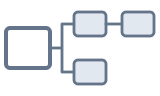
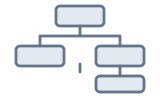
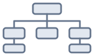
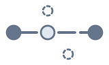
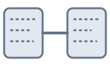
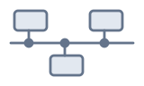
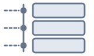
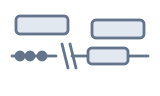
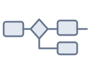

# Antu 案图

[](https://github.com/zh-xx/Antu/actions/workflows/verify.yml)
[](https://github.com/zh-xx/Antu/actions/workflows/codeql.yml)
[](https://github.com/zh-xx/Antu/releases)
[](https://www.npmjs.com/package/@zh-xx/antu)
[](LICENSE)
[](package.json)
[](CHANGELOG.md)
[](https://zh-xx.github.io/Antu/)
[](CONTRIBUTING.md)

[中文](README.zh-CN.md) | **English**

Antu turns one JSON document into one self-contained HTML legal diagram. The page is one file of about 2.3 MB that makes no network request and needs no server; it opens offline and can be archived,
printed or sent as an attachment. An AI Agent can read the case materials and write the JSON; the engine then draws the
diagram from it, and the same JSON gives the same diagram. Antu is at version 0.x, and the formats of the relationship
and justification diagrams are still drafts.

## Diagram Types

Four types of legal content, each drawn in several ways. A selector in the page switches between the ways; nothing in the JSON chooses one.

<table>
<tr><th rowspan="2" align="left" valign="middle">Relationship</th><td align="center"><a href="examples/relationship/marketplace-parties.en.json"><br>graph</a></td><td align="center"><a href="examples/relationship/marketplace-parties.en.json"><br>focus view</a></td><td align="center"><a href="examples/relationship/marketplace-parties.en.json"><br>guarantee chain</a></td><td align="center"><a href="examples/relationship/marketplace-parties.en.json"><br>relation matrix</a></td><td align="center"><a href="examples/relationship/marketplace-parties.en.json"><br>equity tree</a></td></tr>
<tr><td align="center"><a href="examples/relationship/marketplace-parties.en.json"><br>authority chart</a></td><td align="center"><a href="examples/relationship/marketplace-parties.en.json"><br>related-party list</a></td><td align="center"><a href="examples/relationship/marketplace-parties.en.json"><br>relation path</a></td><td align="center"><a href="examples/relationship/marketplace-parties.en.json"><br>camp summary</a></td></tr>
<tr><th rowspan="1" align="left" valign="middle">Fact</th><td align="center"><a href="examples/fact/neighbour-corridor-charging.en.json"><br>timeline</a></td><td align="center"><a href="examples/fact/neighbour-corridor-charging.en.json"><br>chronicle</a></td><td align="center"><a href="examples/fact/neighbour-corridor-charging.en.json"><br>time scale</a></td></tr>
<tr><th rowspan="1" align="left" valign="middle">Procedure</th><td align="center"><a href="examples/procedure/05-premises-lease.en.json"><br>flowchart</a></td><td align="center"><a href="examples/procedure/05-premises-lease.en.json"><br>route map</a></td></tr>
<tr><th rowspan="1" align="left" valign="middle">Justification</th><td align="center"><a href="examples/justification/fang-yuan-defense-excess.en.json"><br>reasoning tree</a></td></tr>
</table>

Relationship diagrams show parties, roles and legal relationships; fact diagrams the time, the participants and how events went;
procedure diagrams a procedural path and its branches; justification diagrams a conclusion drawn from norms and facts. The
relationship and justification schemas are still drafts.

Three looks, called **themes**: `document` (black and white and square, for print and filing; the default), `modern`
(rounded, pale) and `legal` (navy). The reader switches in the page, or a call fixes a page to one. Only the diagram is
themed. See [spec/theme.md](spec/theme.md).

## Usage

```bash
npm install
npm run diagram -- examples/fact/neighbour-corridor-charging.en.json
```

The page is written beside the JSON file. The interface language of a page is set with `?lang=en` or `?lang=zh`; the case content is never translated.

## Principle

```
Agent ──> key information ──> one JSON ──> engine ──> diagram
```

| Role | Does | Determinism |
|---|---|---|
| Model | reads documents, extracts facts, understands meaning | the result may differ from run to run |
| Engine | draws the diagram according to the specification | the same JSON gives the same diagram, whichever model wrote it |
| JSON specification | the only interface between the two | versioned (see [spec/versioning.md](spec/versioning.md)) |


The engine does not write JSON, and the Agent does not draw. The model puts information into JSON; the engine draws. The JSON specification is a specification of its own, for four reasons:

1. General-purpose charting syntax is built on nodes, edges and state machines, and has no place for procedural standing or the source of a piece of evidence.
2. The diagram does not depend on which model extracted the information.
3. The same JSON gives the same diagram at any time and in any environment, so a diagram handed to a court or to the other side can be reproduced.
4. The source is recorded when the facts are extracted: each fact states the document, the page and the provision it rests on, and the diagram shows them. The materials themselves are neither bundled nor linked.

## Agent Integration

The reference material for an Agent, for the fact diagram, is a field table of about 3.3k characters and a mechanism note of about 6.2k characters.

### Skill

```
npx skills add zh-xx/Antu -g
```

The Skill is in [`skills/antu/`](skills/antu/); each [release](https://github.com/zh-xx/Antu/releases) also carries it as `antu-skill-<version>.zip`.

The command line asks the npm registry once a day whether a newer Antu is out (one GET request, nothing of any diagram) and, if so, ends its output with a notice. `ANTU_NO_UPDATE_NOTIFIER=1` turns it off.

### MCP

The MCP server is the npm package [`@zh-xx/antu`](https://www.npmjs.com/package/@zh-xx/antu), registered as `io.github.zh-xx/antu` in the [MCP registry](https://registry.modelcontextprotocol.io).

```json
{
  "mcpServers": {
    "antu": {
      "command": "npx",
      "args": ["-y", "-p", "@zh-xx/antu@latest", "antu-mcp"]
    }
  }
}
```

Tools: `antu_schema`, `antu_guide`, `antu_examples`, `antu_validate`, `antu_layout`, `antu_render`, `antu_preview`, `antu_versions`.

## Documentation

- Design documents for people, under [`spec/`](spec/): [architecture](spec/v0-architecture.md), [the source types](spec/source-schema-draft.md), [themes](spec/theme.md), [the MCP server](spec/mcp-server.md), and the diagrams ([fact](spec/fact/), [procedure](spec/procedure/schema-draft.md), [relationship](spec/relationship/schema-draft.md), [justification](spec/justification/schema-draft.md)). The notes for Agents are under [`spec/agent/`](spec/agent/).
- [CHANGELOG.md](CHANGELOG.md) and the versioning rules in [spec/versioning.md](spec/versioning.md).
- Known problems and requests are tracked as [GitHub issues](https://github.com/zh-xx/Antu/issues). Working rules for contributors are in [CONTRIBUTING.md](CONTRIBUTING.md).

## License

Copyright (C) 2026 Ji Cheng.

Antu is free software, licensed under the **GNU Affero General Public License, version 3 or any later version** ([`LICENSE`](LICENSE), SPDX `AGPL-3.0-or-later`). In short: you may use, study, change and share it, including for commercial purposes. If you distribute a changed version, or let others use it over a network (for example as a hosted service), you must release your changes under the same licence, keep the copyright and licence notices, and make the source available. There is no warranty. This summary is not the licence; the licence text is.

- **Additional permission (AGPL section 7).** A page made with Antu contains Antu's code together with the diagram data you gave it. The diagram data, and the content of the diagram you drew from your material, are not part of Antu and are not covered by this licence: you may keep them private, publish them, or sell them on any terms you like. The licence covers Antu's code in the page, and the notices in the page must stay with it. The same text is in every page and at the top of the command line.
- Everything in the repository (the code, the examples, the specifications and the guides) is under the same licence, except what is named below.
- Code of other projects inside the pages and the command line keeps its own licence. Its notices are in [`skills/antu/THIRD-PARTY-NOTICES.md`](skills/antu/THIRD-PARTY-NOTICES.md), and also inside every page and at the top of the command line, together with the licence of Antu and the place of the source of that version.
- The cases in `examples/` and the judgment texts in `examples/raw/` are fictional: the people, companies, dates, amounts and provisions are made up for Antu and match no real case. They are under the same licence.
- Versions up to 0.5.0 were published without a licence file. The licence applies from 0.5.1.
